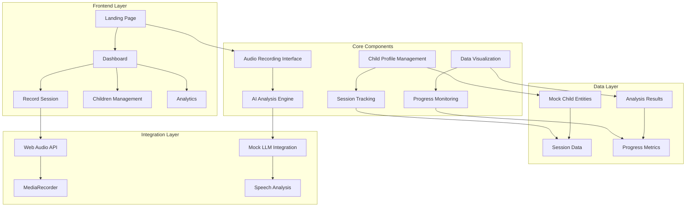

# 🧸 BabbleBear Baby Bliss

A comprehensive baby speech development tracking application that helps parents monitor and analyze their child's babbling patterns using AI-powered analysis.

## 🌟 Overview

BabbleBear Baby Bliss is a modern web application designed to track and analyze baby speech development. The app provides a user-friendly interface for recording babble sessions, managing child profiles, and gaining insights into speech development patterns through AI analysis.

## 🏗️ System Architecture



## 🚀 Features

### 📊 Dashboard
- **Welcome Header**: Personalized greeting with child count and development status
- **Babble Score Card**: Daily speech development score with trend analysis
- **Recent Sessions**: Quick overview of latest recording sessions
- **Quick Actions**: Easy access to key features
- **Daily Insights**: AI-powered recommendations and tips

### 🎤 Recording Interface
- **Child Selection**: Choose which child to record
- **Audio Recording**: Real-time audio capture with visualization
- **Session Timer**: Track recording duration
- **AI Analysis**: Automatic speech pattern analysis
- **Results Display**: Detailed breakdown of babble metrics

### 👶 Child Management
- **Profile Creation**: Add multiple children with birth dates
- **Age Calculation**: Automatic age computation in months/years
- **Session History**: Track all recordings per child
- **Progress Monitoring**: Visual progress indicators

### 📈 Analytics & Insights
- **Speech Development Tracking**: Monitor babble scores over time
- **Phoneme Diversity Analysis**: Track sound variety
- **Vocalization Patterns**: Analyze speech frequency and duration
- **Developmental Flags**: Identify potential areas of concern

## 🛠️ Technology Stack

### Frontend
- **React 18**: Modern UI framework with hooks
- **TypeScript**: Type-safe development
- **Vite**: Fast build tool and development server
- **React Router**: Client-side routing

### UI/UX
- **Tailwind CSS**: Utility-first styling
- **shadcn/ui**: High-quality component library
- **Framer Motion**: Smooth animations and transitions
- **Lucide React**: Beautiful icon library

### Audio Processing
- **Web Audio API**: Browser-based audio capture
- **MediaRecorder**: Audio recording capabilities
- **Audio Visualization**: Real-time waveform display

### Data Management
- **Mock Entities**: Simulated backend with realistic data
- **Local State Management**: React hooks for state
- **Async Operations**: Promise-based data handling

## 🎨 Design System

### Color Palette
- **Primary**: Amber/Orange warm tones
- **Secondary**: Cozy forest nursery theme
- **Accent**: Emerald green for positive metrics
- **Background**: Gradient backgrounds for depth

### Typography
- **Headings**: Bold, warm-colored text
- **Body**: Readable, medium-weight text
- **UI Elements**: Consistent button and card styling

## 📁 Project Structure

```
src/
├── components/
│   ├── ui/                 # Reusable UI components
│   ├── dashboard/          # Dashboard-specific components
│   ├── record/            # Recording interface components
│   └── children/          # Child management components
├── pages/                 # Main application pages
├── entities/              # Data models and mock entities
├── integrations/          # External service integrations
├── lib/                   # Utility functions
└── hooks/                 # Custom React hooks
```

## 🚀 Getting Started

### Prerequisites
- Node.js 18+ 
- npm or yarn package manager

### Installation

```bash
# Clone the repository
git clone https://github.com/Babelly-The-Bear/babblebear-baby-bliss.git

# Navigate to project directory
cd babblebear-baby-bliss

# Install dependencies
npm install

# Start development server
npm run dev
```

### Development Commands

```bash
# Start development server
npm run dev

# Build for production
npm run build

# Preview production build
npm run preview

# Run linting
npm run lint
```

## 🎯 Key Components

### Core Pages
1. **Landing Page** (`/`): Welcome page with navigation
2. **Dashboard** (`/dashboard`): Main post-login interface
3. **Record** (`/record`): Audio recording and analysis
4. **Children** (`/children`): Child profile management

### Key Components
- **Sidebar**: Navigation and quick stats
- **BabbleScoreCard**: Daily speech development score
- **RecentSessions**: Session history display
- **QuickActions**: Feature shortcuts
- **DailyInsights**: AI-powered recommendations

## 🔧 Configuration

### Environment Variables
Currently using mock data - no external API keys required for development.

### Audio Settings
- **Sample Rate**: Browser default
- **Format**: WAV/WebM
- **Quality**: High quality for analysis

## 🧪 Testing

The application uses mock data for development and testing:
- **Child Entities**: Simulated child profiles
- **Session Data**: Mock recording sessions
- **AI Analysis**: Simulated LLM responses

## 🚀 Deployment

### Vercel (Recommended)
```bash
# Install Vercel CLI
npm i -g vercel

# Deploy
vercel
```

### Netlify
```bash
# Build the project
npm run build

# Deploy to Netlify
# Upload the dist/ folder to Netlify
```

## 🤝 Contributing

1. Fork the repository
2. Create a feature branch (`git checkout -b feature/amazing-feature`)
3. Commit your changes (`git commit -m 'Add amazing feature'`)
4. Push to the branch (`git push origin feature/amazing-feature`)
5. Open a Pull Request

## 📝 License

This project is licensed under the MIT License - see the [LICENSE](LICENSE) file for details.

## 🙏 Acknowledgments

- **shadcn/ui** for the beautiful component library
- **Framer Motion** for smooth animations
- **Tailwind CSS** for the utility-first styling approach
- **Lucide** for the comprehensive icon set

## 📞 Support

For support, please open an issue in the GitHub repository or contact the development team.

---

**Made with ❤️ for parents and their little ones**
